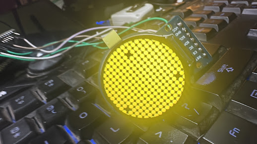

 
"Oh. It's you."

Professionally I've spent most of my career in IT, with a short stint in automotive repair. Personally I've done just about everything, collecting skills and finding new ways to use them. The end result is rarely the goal. It's the exploration that really drives me. This has led me to some significant success in applying QDM/LEAN Manufacturing methodology to improve processes both at work and at home by combining random skills into unique solutions.

My journey slinging code began back in the day with the Commodore Vic-20, when the only option to save work was with a cassette tape. (Kids, ask your grandpa about those). These days I'm mostly playing with Python and C++  to program random projects on Raspberry Pi's and Arduinos.
<!--
**golemedia/golemedia** is a ✨ _special_ ✨ repository because its `README.md` (this file) appears on your GitHub profile.

Here are some ideas to get you started:

- 🔭 I’m currently working on ...
- 🌱 I’m currently learning ...
- 👯 I’m looking to collaborate on ...
- 🤔 I’m looking for help with ...
- 💬 Ask me about ...
- 📫 How to reach me: ...
- 😄 Pronouns: ...
- ⚡ Fun fact: ...
-->
